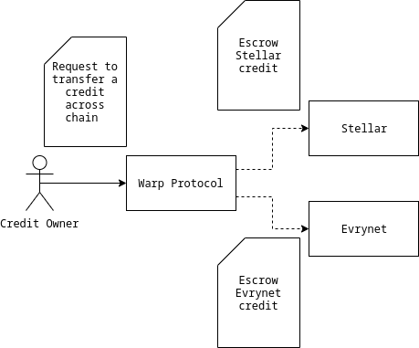
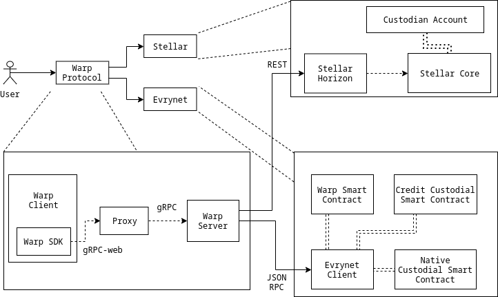

# WARP-CLIENT

> This project has been bootstrapped with [Create React App](https://github.com/facebook/create-react-app), 
> [Warp-js](https://github.com/Evrynetlabs/warp-js), and [Evrynet](https://evrynet.io).

Warp Protocol is a rotocol that utilized the custodian concept to move credits between chains. The credit is basically exist on two chain at the same time but, only single chain at a time can do the credit transaction. Which means, on the the other chain, the credit will be locked.

The public testnet version of warp client is [here](https://warp-client.evrynet.io)

### Overview




### Flows



#### Summary of flows

Warp client is responsible providing an interface for end-users to interact our warp contract with Warp SDK as a core logic for scaffolding the raw transaction and Warp API for validating a raw transaction sent by warp SDK and submit to each chains (either Stellar or Evrynet).

#### Develop Roadmap
- [x] Support warp process from stellar to evrynet
- [X] Supprot warp process from evrynet to stellar  
- [x] Custodian Smart Contracts
- [x] Credit Contracts 
- [x] Whitelist Contracts
- [x] Warp SDK (interface tor Warp API)
- [x] Support new credit type (EER2)
- [ ] Refund transaction
- [ ] Authentication
- [ ] Transaction history

#### Contribution

```
# clone the repository
git clone https://github.com/Evrynetlabs/warp-client.git
```

## Installing / Getting started
----

> This repository already provided you easy steps for starting the project. You can start the project through `make` commands

## Developing
----

### Build With
- create-react-app
- React.js
- bootstrap

### Prerequisites
- Knowledge of Warp Contract [here](https://github.com/evrynetlabs/warp-contract)
- Knowledge of EER-2 (Evrynet Enhancement Request) [here](https://github.com/evrynetlabs/credit-contract)
    - User needs to `setApprovalForAll(address _operator, bool _approved)` and let a custodian contract as an operator.
     - For custom credit contract, user needs to `SetMinter(uint256 indexed _typeID, address _minter);` and let let a custodian contract as a minter.

### Building and Starting up the application

In the project directory, you can run:

> `make compose-dev`

For full docker-compose local run, or

> `make compose-build`

For only building a docker compose images.

And if you only want to run the application with existing build services as well, run:

> `make compose-run`

For Lint check, run:

> `make lint`

On `make compose-run` and `make compose-build`, you can specify warp configuration environments through flags

> `make compose-up`

You can use `make compose-up` instead of `make compose-dev`, but don't forget to specify environment as stated in available flags

Example:

``` 
    make compose-dev \
    native_asset_custodian_address=0x94DC9f9e30C8CbA5F1aADEEA2eb8b946EA20A1A6 \
    evrynet_credit_custodian_address=0x5741D325938A061aBfCd05F2901B46bE55D53e9d \
    stellar_credit_custodian_address=0xc1594110aF71D31c7F64F1EeD1f540307964873c \
    grpc_host=http://localhost:8080 \
    http_provider_host=http://localhost:22001 \
    stellar_escrow_account=GAFJLRTTAKQNLXDSPE6E735JODHW2DQF5UFPIMV4TPJDH6A44QNLSU6A \
    stellar_issuer=GARBMXW7IQBII2TX7YQLXI24YUYR5QYRH2UF36HLHFUGCZSTG24QB6JN \
    stellar_network='Test SDF Network ; September 2015'
```
## Configuration
----

### Available flags: 

| Flag | Environment | Description | required | Default
| --- | --- | --- | --- | --- |
| `native_asset_custodian_address` | `NATIVE_ASSET_CUSTODIAN_ADDRESS` |address of native asset custodian contract| required | - |
| `stellar_credit_custodian_address` | `STELLAR_CREDIT_CUSTODIAN_ADDRESS` |address of stellar credit custodian contract| required | - |
| `evrynet_credit_custodian_address` | `EVRYNET_CREDIT_CUSTODIAN_ADDRESS` |address of evrynet credit custodian contract| required | - |
| `grpc_host` | `WARP_GRPC_HOST` | grpc host from warp client to grpc proxy| optional | localhost:9090 |
| `http_provider_host` | `WARP_HTTP_PROVIDER_HOST` | host of evrynet http provider | optional | web3.givenProvider |
| `stellar_escrow_account` | `WARP_STELLAR_ESCROW_ACCOUNT` | stellar custodian account for collecting tokens | required | - |
| `stellar_issuer` | `WARP_STELLAR_ISSUER` | issuer account for evry credit on stellar chain | required | - |
| `stellar_network` | `WARP_STELLAR_NETWORK` | stellar network | optional | 'Test SDF Network ; September 2015' |

## Tests
----

For unit testing, run:

> `make test`

Jest as well as Enzyme has been used for testing libraries.

## Api Reference
----

Please see [this link](https://github.com/Evrynetlabs/warp)


## Licensing
----

Warp client is licensed under the OSL Open Software License v3.0, also included in our repository in the LICENSE file.


